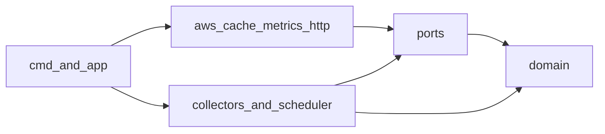
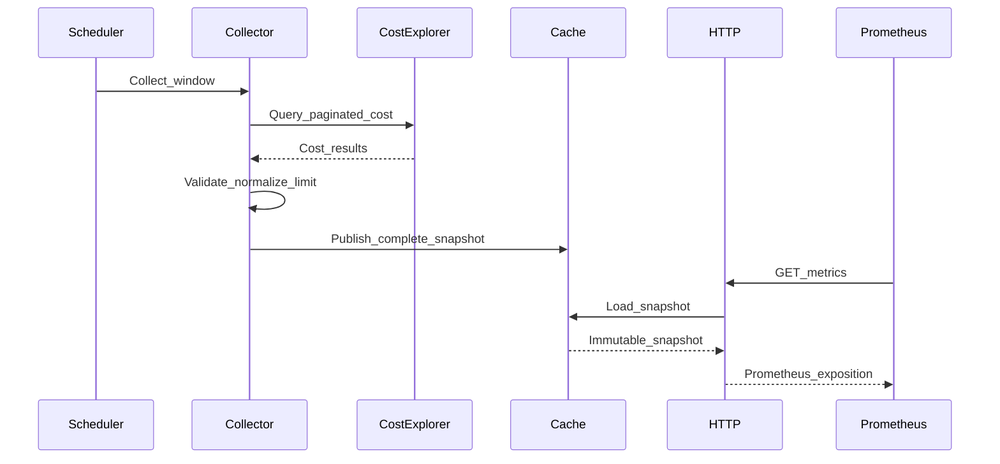

# Architecture

## Purpose

aws-cost-exporter converts low-frequency AWS billing data into stable
Prometheus metrics. It is an exporter, not a billing database, dashboard, or
financial reconciliation system. AWS Cost Explorer remains the source of truth,
while Prometheus provides time-series retention, querying, visualization, and
alerting.

The architecture optimizes for predictable AWS API usage, fast scrapes, bounded
metric cardinality, failure isolation, and straightforward extension.
Prometheus scrapes never trigger an AWS request: a background scheduler refreshes
an in-memory snapshot and the HTTP handler serves that snapshot.

## Architectural style

The project is a modular monolith using Clean Architecture with limited
domain-driven design:

- `internal/domain/cost` owns money, time periods, dimensions, forecasts, and
  snapshot invariants. It depends only on the Go standard library.
- `internal/ports` defines narrow interfaces required by application logic.
  Infrastructure-specific types do not cross these interfaces.
- `internal/collector` translates collection requests into domain snapshots.
- `internal/scheduler` owns refresh timing, concurrency, and retry orchestration.
- `internal/aws/costexplorer` adapts aws-sdk-go-v2 to application ports.
- `internal/cache/memory` publishes immutable snapshots atomically.
- `internal/metrics` maps domain snapshots to fixed Prometheus descriptors.
- `internal/httpserver` exposes metrics, probes, version, and optional debugging.
- `internal/app` is the composition root and performs manual dependency
  injection.
- `cmd/aws-cost-exporter` contains only process entry-point behavior.

Dependencies point inward:

The domain must not import AWS SDK, Prometheus, Viper, Cobra, or HTTP packages.
Collectors must not depend on HTTP or Prometheus. Metrics must not call AWS.

## Runtime data flow

Each collector publishes only after every required page is received and
validated. A failed refresh preserves the previous successful data. Snapshot
reads use an atomic pointer and do not acquire an application lock.

## Collection model

AWS Cost Explorer permits at most two grouping dimensions per request. The MVP
uses separate collectors and metric families for total, service, region, linked
account, and forecast data. It does not expose a service-by-region-by-account
Cartesian product.

MVP cost values use `UnblendedCost`, UTC billing periods, and the currency
returned by AWS. Dates are not metric labels. Each grouped dimension has a
configurable series limit; overflow values are aggregated into `__other__` so
the total remains conserved.

Collectors are registered explicitly through factories. Registration does not
use package `init` side effects or Go runtime plugins. New collectors implement
the internal collector contract and share scheduler, cache, and metrics
infrastructure.

## Scheduling and failure behavior

The default refresh interval is six hours because Cost Explorer data updates
infrequently and API pagination is billable. Startup and periodic refreshes use
jitter, a shared rate limiter, bounded concurrency, and single-flight execution
per collector.

The AWS SDK owns request-level retries for throttling, server errors, and
transient network failures. The scheduler owns refresh-level backoff. Permanent
authorization or validation errors wait for the normal schedule.

Readiness requires an initial snapshot and sufficiently fresh required
collectors. Liveness represents process health only. Stale snapshots remain
available from `/metrics` with explicit age and collector health metrics so
users can distinguish old data from zero cost.

## Security boundaries

AWS authentication uses the default credential chain; static access keys are not
configuration fields. The MVP requires only `ce:GetCostAndUsage` and
`ce:GetCostForecast`. Debug endpoints are disabled by default and must not expose
configuration, credentials, environment variables, or raw AWS responses. Logs
and metric labels use structured, bounded, non-sensitive fields. Log rotation is
delegated to the runtime as defined in [logging operations](docs/operations/logging.md).

## Compatibility policy

Metric names, types, labels, configuration keys, HTTP paths, and exit codes are
public contracts. Before v1.0, incompatible changes require release notes and a
migration path when practical. At v1.0, stable contracts follow semantic
versioning. Renaming or removing metrics, changing label sets or cost semantics,
and weakening security defaults are incompatible changes.
