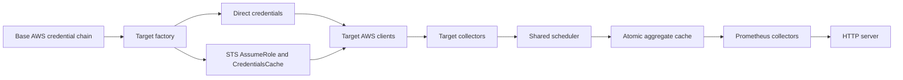

# Architecture

## Purpose

aws-cost-exporter converts low-frequency AWS billing APIs into stable, target-scoped Prometheus metrics. AWS remains the source of truth. The exporter is not a billing database or financial reconciliation system.

Prometheus scrapes never trigger AWS requests. Background collectors publish immutable partial results into one atomic in-memory aggregate snapshot.

## Modular monolith

- `internal/domain` owns target identity, cost, budget, organization, and aggregate snapshot values.
- `internal/ports` defines narrow application interfaces.
- `internal/collector` maps reader ports to typed partial snapshots.
- `internal/scheduler` owns per-job intervals, target-scoped single-flight, one-at-a-time target execution, global concurrency, and bounded refresh backoff.
- `internal/aws` owns SDK clients, AssumeRole, request attempts, pagination, mapping, and safe error classification.
- `internal/cache/memory` owns copy-on-write partials keyed by `CollectorID` and atomic aggregate publication.
- `internal/metrics` maps snapshots and bounded events to fixed Prometheus descriptors.
- `internal/httpserver` exposes metrics, probes, version, and optional diagnostics.
- `internal/app` is the composition root.

Dependencies continue to point inward; domain packages do not import AWS SDK, Prometheus, HTTP, Cobra, or Viper.

## Identity and aggregate contract

```go
type TargetID string

type CollectorID struct {
    Target TargetID
    Name   string
}
```

Every Cost, Forecast, Budget, Organizations account, partial cache entry, collector status, scheduler job, log event, and target-scoped metric carries target identity.

Collectors return one strong `PartialSnapshot` containing typed cost, forecast, budget, and account slices. The scheduler and cache never use `any` or AWS SDK response types.

## Runtime data flow



One target failure updates only its `CollectorID` status and retains the last successful partial. Other targets continue refreshing and publishing. Each scheduled run has a finite collector-attempt budget, and one target cannot consume multiple global scheduler slots at once.

## AWS request policy

The base AWS config is loaded once. AssumeRole targets use independent credential caches. ExternalId is read from an environment variable and is never included in safe errors or logs.

Every SDK attempt follows:

```text
global limiter → target limiter → SDK attempt token → HTTP request
```

The wrapper is installed through `GetAttemptToken`, so initial attempts and retries are both limited without replacing SDK retry/backoff/token-bucket behavior. Context cancellation stops limiter waits, retries, pagination, backoff timers, and workers.

Operation, status, and reason labels are fixed enums. Arbitrary AWS messages and request IDs cannot become metric labels.

## Snapshot and cardinality

Cache writes use a mutex, copy the parts/status maps, rebuild a deterministic aggregate, and publish it through an atomic pointer. Scrapes read the pointer without application locks and iterate immutable values without copying entire slices.

Organizations raw metadata is joined with either the configured account allowlist or observed linked-account cost dimensions. Account email is discarded. Budget names are explicit allowlists. All pages and exposed series have hard limits.

## Readiness and HA

Required targets gate readiness through all enabled Cost Explorer collectors. Optional targets, Organizations, and Budgets remain observable but do not make the whole process unready. Liveness reports process health only.

v0.2 remains single-replica. See [ADR 0002](docs/adr/0002-ha-refresh-coordination.md) for the HA evaluation.

## Compatibility

v0.2 intentionally replaces the v0.1 configuration and label contract. It has no legacy mode, migration layer, dual exposition, deprecated aliases, or `config_version`. HTTP paths and existing metric names remain stable; target-scoped metrics add the mandatory `target` label.
